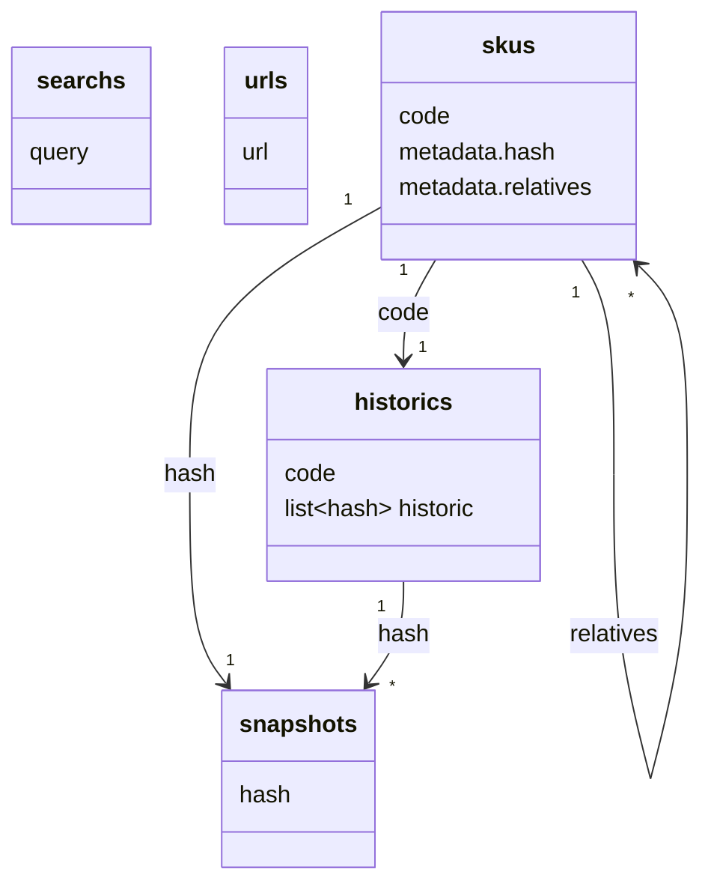

# mongodb

## \<marketplace>
Cada marketplace possue seu próprio banco de dados, por isso substitua "\<marketplace>" pelo nome daquele marketplace em [snake_case](https://en.wikipedia.org/wiki/Snake_case). Se tivessemos falando da [Ri Happy](https://www.rihappy.com.br/), o nome do banco seria "ri_happy".  

### searchs
Armazena queries a serem executadas no marketplace de tempos em tempos. A idéia é buscar no marketplace por termos genéricos que pode trazer produtos diferentes com o tempo, ou seja, **não** são queries para produtos específicos.  

### urls
Armazena os URLs visitados nos últimos X dias. Para reduzir a quantidade de requests a um marketplace, damos um tempo antes de visitar páginas que já visitamos nos últimos dias.  

### skus
Armazena os SKUs do marketplace no atual momento dele (dentro do intervalo de tempo definido na collection "urls"). Isto é necessário pois um SKU pode mudar diversas vezes com o tempo.  

### historics
Armazena todos os hashs que um SKU já teve. Sempre que um SKU é atualizado ou inserido, o hash dele é calculado e inserido no histórico dele. Isto é importante para se conseguir buscar na collection "snapshots" como ele era naquele determinado tempo.   

### snapshots
Armazena todos os estados dos SKUs, sendo assim possível ver como ele era em determinado dia.  
