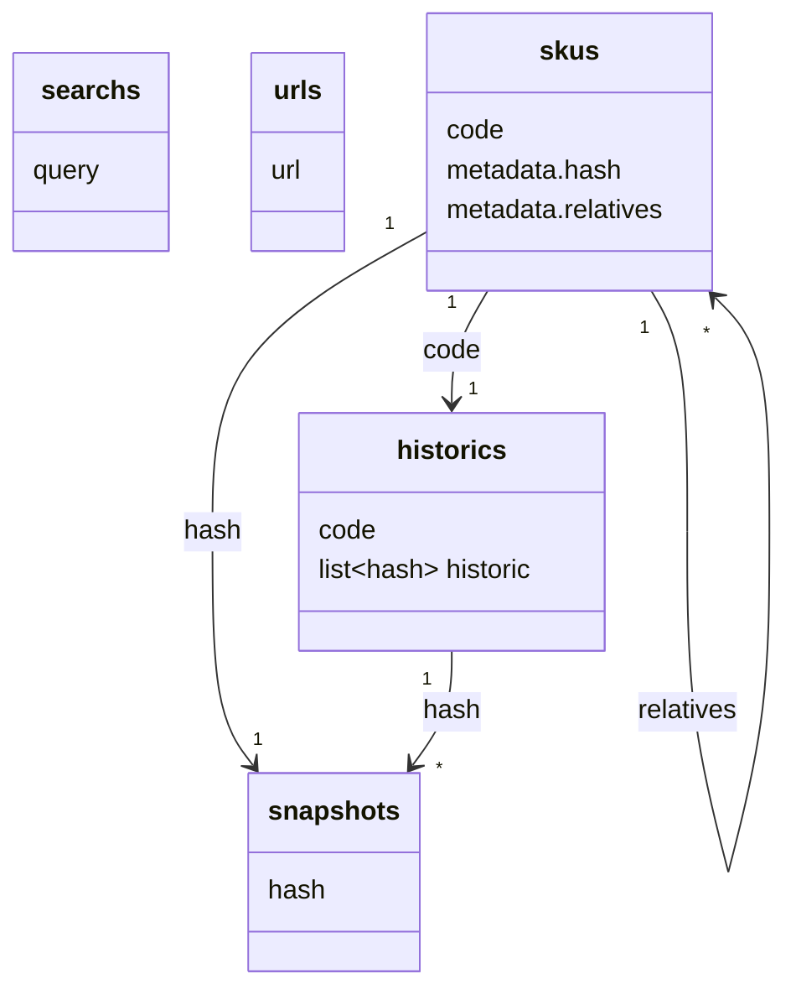

# mongodb

## \<marketplace>
Cada marketplace possue seu próprio banco de dados, por isso subsitua "\<marketplace>" pelo nome daquele marketplace em [snake_case](https://en.wikipedia.org/wiki/Snake_case). Se tivessemos falando da [Ri Happy](https://www.rihappy.com.br/), o nome do banco seria "ri_happy".  

### searchs
Collection com queries a serem executadas no marketplace de tempos em tempos. A idéia é buscar no marketplace por termos genéricos que pode trazer produtos diferentes com o tempo, ou seja, **não** são queries para produtos específicos.  

### urls

### skus

### historics

### snapshots
